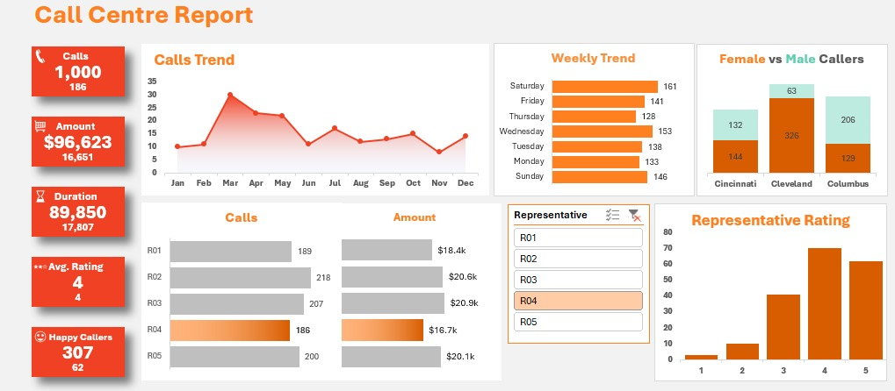

# 📞 Call Center Analysis Dashboard  

## 📷 Dashboard Preview  

## 📌 Project Overview  
This project involves building an **interactive Excel dashboard** for **call center performance analysis**, leveraging **data modeling, pivot tables, and dynamic charts** to track key call center metrics and agent performance.  

## 📊 Tracked KPIs  
- **Total Calls** 📈  
- **Call Duration (Seconds) ⏳**  
- **Purchase Amount 💰**  
- **Satisfaction Rating ⭐**  

## 🛠️ Features & Visualizations  
- **Data Modeling:** Designed a **relational model** with **Customers** and **Calls** tables.  
- **Monthly Call Trends:** Line graph to track long-term trends.  
- **Weekly Trends (Sun-Sat):** Bar chart to analyze call volume variations.  
- **Calls & Revenue by Representative:** Dynamic bar chart for performance insights.  
- **Customer Demographics Analysis:** Stacked bar chart (calls by city & gender).  
- **Satisfaction Rating Distribution:** Histogram to evaluate customer feedback.  
- **Interactive Elements:** Pivot tables, slicers, and conditional formatting for dynamic reporting.  

## 🚀 Tech Stack  
- **Microsoft Excel** (Pivot Tables, Charts, Data Modeling)  
- **Power Query** (for Data Cleaning & Transformation)  

